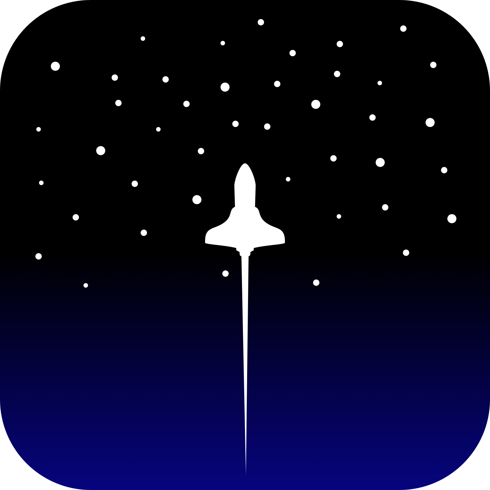
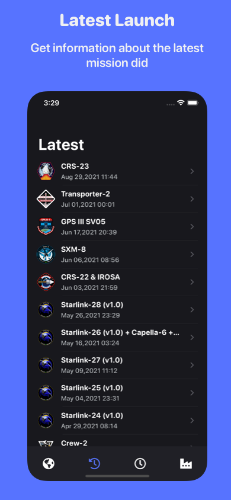
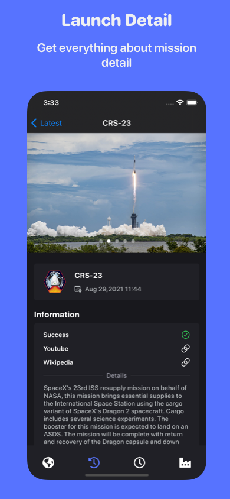
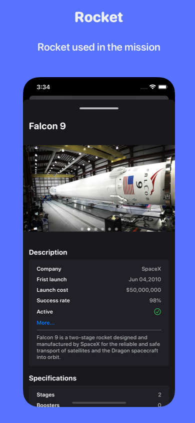
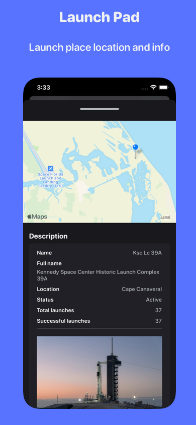

# To The Stars 🚀

### Are you interested Spacex activision ? 
This app show you every things about this company like misisons and upcoming launch.
App written in [SwiftUI](https://developer.apple.com/xcode/swiftui/)

## Preview 📱

    
    
    
    
    

## How to build 🛠

1- Fork the project & Clone it to your desktop.

2- Open it from Xcode (12.0+).

3- Change  the Build identifier.

5- build & run.

6- enjoy.

## Contribute 🧩

Want to contribute? I would really appreciate a hand with the development to add more features in this app.
Feel free to Fork, edit, then pull!

